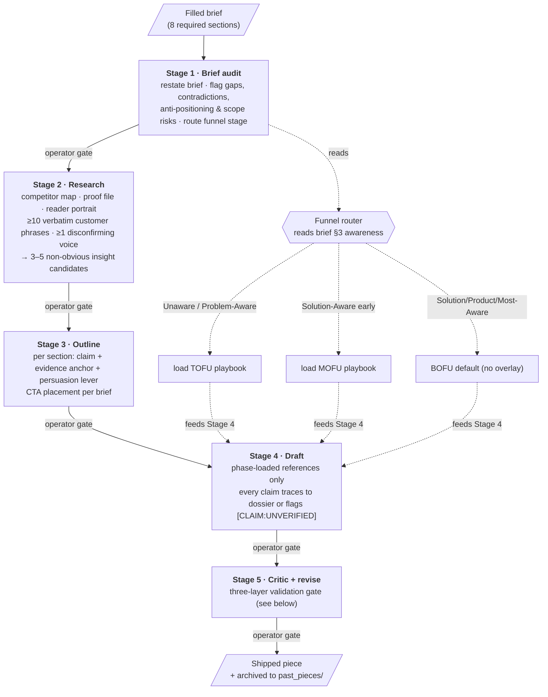
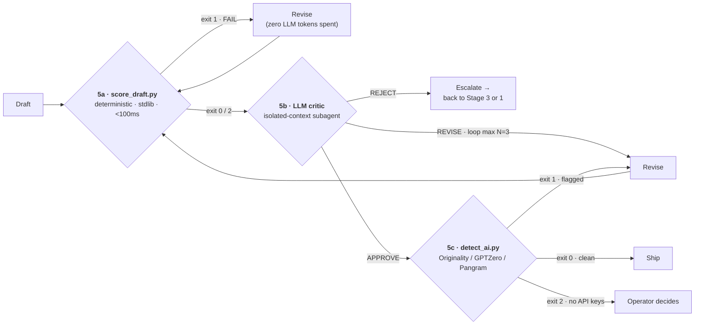
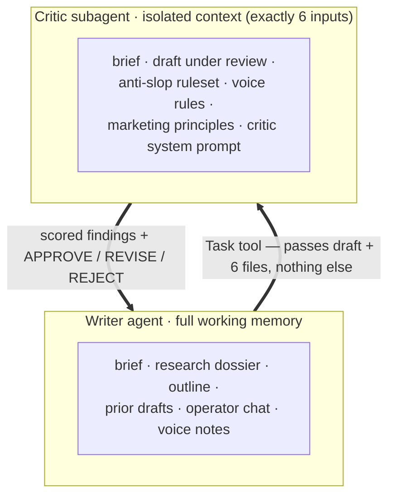

# Anti-Slop Content Engine

> A multi-stage, operator-gated pipeline that turns a structured brief into agency-grade B2B/SaaS bottom-of-funnel content — content that reads as genuinely human, survives third-party AI detectors, and is grounded in researched specifics rather than generative filler.

Built as internal tooling for a B2B GTM / content practice. Packaged here as a **sanitized, truncated portfolio piece**: the architecture, control flow, validation design, and representative code are real and intact; the proprietary rule corpus (the "anti-slop" rulesets, voice fingerprints, critic prompt, and structure templates) is **withheld** — see [`references/REDACTED.md`](references/REDACTED.md) and the [Sanitization note](#sanitization-note) at the bottom.

It is implemented as a **Claude Code Skill** — a packaged agent capability (a Markdown contract + reference corpus + executable Python helpers + an isolated critic subagent) that runs inside an LLM coding/agent runtime.

---

## What it does

Marketing content produced by LLMs has a recognizable failure mode — "slop": throat-clearing intros, rule-of-three everywhere, em-dash addiction, vendor-neutral mush, "in today's fast-paced world" openers, and confident claims with no source. It reads as machine-written, trips AI detectors, and doesn't convert.

This engine attacks that with a **five-stage, human-in-the-loop pipeline** and a **three-layer validation gate**. Given a filled-out brief, it runs:

```
brief audit → research → outline → draft → critic + revise → ship
```

Every stage stops for explicit operator approval before the next begins. The final draft must clear three independent quality gates — a deterministic checker, an isolated-context LLM critic, and an external AI-detector panel — before it ships.

**Output non-negotiables** (enforced by the gates, not just hoped for):
1. Reads as genuinely human.
2. Passes external AI detectors (Originality.AI / GPTZero / Pangram).
3. Demonstrates real domain depth via researched, source-traced specifics.
4. Drives the specific funnel decision the brief was commissioned for.

---

## Architecture



**Design center of gravity:** the brief is the single source of truth for everything piece-specific (length, format, audience, awareness stage, keywords, CTA, voice overrides, positioning frame). The reference corpus holds **only universal rules** that apply to every piece regardless of topic. This separation is what keeps the engine reusable across clients without hard-coding any one client into the rules.

### The validation gate (Stage 5, expanded)

The most important engineering decision in the system: **three independent gates, cheapest first**, so expensive checks never run on drafts that a free check would have rejected.



- **5a — deterministic** ([`src/score_draft.py`](src/score_draft.py)): pure-stdlib regex + statistics. Catches in ~50ms the mechanical tells a language model cannot reliably suppress by instruction alone (em-dash rate, banned phrases/openers, alliterative tricolons, passive-voice spine, low sentence-length *burstiness*, paragraph-length uniformity, and ~15 named structural slop patterns). Exit code is the contract: `0` pass, `1` ≥1 hard FAIL, `2` WARNs only. **Never** invoke the LLM critic while a FAIL is outstanding.
- **5b — LLM critic** ([critic isolation, below](#why-the-critic-runs-in-an-isolated-context)): scored feedback with rule IDs, severity (BLOCKER / SERIOUS / MINOR), line refs, and a verdict (APPROVE / REVISE / REJECT). REVISE loops back through 5a→5b, capped at N=3. REJECT escalates — the piece goes back to outline or brief, not into an infinite revise loop.
- **5c — external detectors** ([`src/detect_ai.py`](src/detect_ai.py)): submits to whichever of Originality.AI / GPTZero / Pangram have API keys configured, gates on a configurable AI% target. Degrades gracefully to "operator decides" when no keys are present.

### Why the critic runs in an isolated context



If the critic shares the writer's context, it goes soft on the writer's own prose — it "remembers" why each choice was made and rationalizes it. So the critic is spawned as a **separate subagent with a deliberately minimal context**: it sees the brief (so it knows what the piece is *supposed* to be) and the universal rules (so it knows what good looks like), and nothing about *how* the draft came to be. This adversarial separation is the single highest-leverage quality mechanism in the engine.

---

## Repository layout

```
Anti-Slop Content Engine/
├── README.md                  ← you are here
├── docs/
│   ├── ARCHITECTURE.md        ← deeper dive: stages, context discipline, state model
│   └── pipeline_contract.md   ← the sanitized skill "contract" (stage table, gates, scope)
├── src/
│   ├── score_draft.py         ← Stage 5a deterministic checker — REAL structure, rule
│   │                            data redacted (representative checks shown in full)
│   └── detect_ai.py           ← Stage 5c external-detector gate — faithful, no IP redacted
├── references/
│   └── REDACTED.md            ← inventory of the withheld proprietary corpus + why
└── .gitignore
```

**What is intentionally not in this repo** (it's the proprietary core): the anti-slop rulesets, the voice rules, the LLM critic's system prompt, the 11 named-writer cadence fingerprints, the per-page-type structure templates, the per-vertical sourcing recipes, the TOFU/MOFU funnel playbooks, and all generated client content. The architecture is fully described; the rules are withheld. See [`references/REDACTED.md`](references/REDACTED.md).

---

## Engineering decisions & tradeoffs

Each of these is grounded in the actual implementation, not aspiration.

**Deterministic gate before the LLM gate.** `score_draft.py` is pure standard library — zero pip dependencies, sub-100ms, exit-code driven. It exists because some rules (the em-dash cap is the canonical example) simply cannot be enforced by prompt instruction — the model agrees, then does it anyway. Running a free regex pass *first* means the expensive LLM critic and the paid external detectors never burn budget on a draft with a mechanical defect. **Tradeoff:** regex can't understand meaning, so the deterministic layer is deliberately scoped to mechanical/structural tells and hands semantic judgment to the critic.

**Banned-phrase data separated from check logic.** Phrase lists live in a single `BANNED_PHRASES` dict at the top of the file, keyed by rule section, as `(phrase, severity)` tuples; the check function iterates the data. Adding a newly-discovered AI tell is a one-line data edit, not a code change. **Tradeoff:** a flat phrase list over-fires on legitimate quotes — handled with a `[QUOTED]` escape tag and a blockquote skip-list so the writer can intentionally quote slop without tripping the checker.

**Statistical "humanness" proxies.** Two checks measure distribution, not words: *burstiness* (sentence-length standard-deviation / mean — humans vary sentence length far more than models) and *paragraph uniformity* (coefficient of variation of paragraph word counts). Both are shown in full in [`score_draft.py`](src/score_draft.py); they leak no proprietary wordlist because they're pure method. **Tradeoff:** these are heuristics with thresholds, tuned empirically, surfaced as WARN (not FAIL) so the operator adjudicates borderline cases.

**Pluggable detector registry.** `detect_ai.py` defines each external service as a data entry (endpoint, auth header, env-var name, pricing note) plus a normalizing `check_<name>()` adapter that maps each vendor's bespoke response into a common `{ai_pct, human_pct, raw_response}` shape. Adding a fourth detector is two edits. Keys are read **only** from environment variables — never hard-coded, never committed. **Tradeoff:** vendors change response shapes; the adapter raises a typed `DetectorError` and surfaces the raw JSON in `--json` mode so the parser break is obvious and localized.

**Phase-loaded context, never all-at-once.** References are loaded per stage (research frames in Stage 2, voice/headline/lead/anti-slop rules in Stage 4, etc.), and the full inherited ruleset (thousands of lines) is *operator-only* and never loaded at runtime. In an LLM agent, context is the scarce resource; loading the right ~2MB at the right stage instead of everything up front is what keeps the engine coherent over a long multi-stage run.

**Funnel-aware, BOFU-default.** A router reads the brief's awareness level and conditionally overlays a TOFU or MOFU playbook on top of the universal baseline. The honest scope position (documented, not buried): BOFU output is the most validated; TOFU/MOFU ship as additive playbooks whose exemplar libraries are thinner. The engine flags this rather than pretending parity.

**Operator-gated, not autonomous.** Every stage stops for human approval. This is a content *pipeline*, not an autopilot — the design assumes a skilled operator who decides which insights to feature, when to ship, and when to override a gate. State is otherwise immutable at runtime: the engine never auto-mutates its voice profile or rule files.

---

## Productionisation / known limitations

Stated honestly — this is internal tooling that has been pressure-tested, not a hardened SaaS product.

- **Validation depth.** The engine was built and pressure-tested against a single writing-test brief (a video-testimonial SaaS product; client anonymized) plus a manually-scored critic regression set. It has **not** yet run a full paid client brief end-to-end; the first real engagement will surface calibration issues.
- **External detectors are best-effort.** Stage 5c only fires when API keys are present; otherwise it exits "no services available" and defers to the operator. AI detectors are also a moving target — a pass today is not a guarantee next quarter.
- **Heuristic thresholds.** Burstiness/uniformity cutoffs and the em-dash cap are empirically tuned, not learned. They surface as warnings for operator judgment rather than hard rejections.
- **Passive-voice detection is a heuristic**, not a parser — a past-participle + auxiliary regex, deliberately rough.
- **No CI/test automation here.** The private skill ships a deterministic regression runner and a critic regression set; those are described but not included in this portfolio cut.
- **Single-operator design.** There's no multi-user state, queueing, or web UI — it runs inside an LLM agent runtime driven by one operator.

---

## Tech & footprint

- **Language:** Python 3 (the runtime helpers). `score_draft.py` is **pure standard library**; `detect_ai.py` uses `urllib` from stdlib for HTTP (zero third-party deps in the included cut).
- **Runtime:** packaged as a Claude Code Skill — a Markdown contract + phase-loaded reference corpus + executable helpers + a Task-spawned isolated critic subagent.
- **Runtime payload during a brief:** ~2MB of Markdown + 2 Python scripts. Everything else is reference/archive/scaffolding loaded on demand.
- **Frameworks referenced** (public canon, used as analytical lenses, not reproduced): Schwartz (awareness/sophistication), Dunford (positioning), Cialdini (persuasion levers), Hopkins (reason-why/specificity).

---

## Sanitization note

This is a deliberately sanitized, truncated cut of a private production skill, prepared for portfolio use. Specifically:

- **No secrets are present.** All API keys are read from environment variables (`ORIGINALITY_API_KEY`, `GPTZERO_API_KEY`, `PANGRAM_API_KEY`) — none are hard-coded or committed. The repo was scanned for tokens (`eyJ…` JWTs, bearer tokens) and contains none.
- **The proprietary rule corpus is withheld**, not just minified: anti-slop rulesets, voice rules, the critic system prompt, writer-cadence fingerprints, structure templates, sourcing recipes, and funnel playbooks are described at the architectural level only. See [`references/REDACTED.md`](references/REDACTED.md).
- **`score_draft.py` is structurally faithful but rule-redacted.** The data types, runner registry, aggregation, exit-code contract, and CLI are the real code; representative method-only checks (em-dash, burstiness, paragraph uniformity) are shown in full; the banned-phrase data and the pattern-matching check bodies are replaced with redaction markers.
- **`detect_ai.py` is faithful** — it contains no proprietary content, so it ships intact aside from key handling already being env-var based.
- **Client and employer identifiers removed.** The one real writing-test client is referred to only generically ("a video-testimonial SaaS product, client anonymized"); the employer is referred to neutrally; absolute user paths are genericized to `~/…`.
