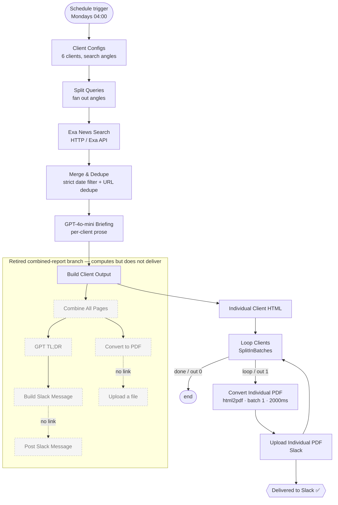

# Client Briefing Automation

An n8n workflow built for **Astris Partners** that produces and delivers a weekly
**per-client news-intelligence briefing** for each portfolio company. Every Monday it
researches recent news across multiple angles, filters for freshness, writes an
executive-style briefing with an LLM, renders each one to a branded PDF, and posts the
PDFs into a Slack channel — fully unattended.

> **Note on data:** This is a sanitized copy of a production workflow. API credentials
> are stubbed and client names are fictionalized. See [Sanitization](#sanitization) at
> the bottom. All logic, wiring, scheduling, and the real client-count scale are
> preserved unchanged.

---

## What it does

For each client in the config (6 portfolio companies, spanning dental RCM, medtech
compliance, digital mental health, nonprofit giving, entertainment payroll, and AI
sourcing), the workflow:

1. Fans the client's brief out into several **search angles** (M&A / funding,
   regulatory / policy, technology / product).
2. Queries the **Exa** news API for each angle.
3. **Merges and de-duplicates** results, rejecting anything stale or undated.
4. Generates a tailored **executive briefing** per client with `gpt-4o-mini`.
5. Renders each briefing to a **PDF** via `html2pdf.app`.
6. Uploads each client PDF to a **Slack** channel.

---

## Architecture

The **per-client loop** (right side) is the live shipping path. The
**combined-report branch** is intentionally left disconnected — see
[Engineering decisions](#engineering-decisions--tradeoffs).

---

## Request / data flow

- **Trigger** — n8n schedule trigger fires weekly on Mondays at `04:00`.
- **Config → fan-out** — `Client Configs` holds each client's industry, competitors,
  personas, and a set of search queries; `Split Queries` emits one item per
  client-query pair.
- **Retrieval** — `Exa News Search` POSTs each query to `api.exa.ai/search`
  (`category: news`, `numResults: 5`) with a rolling `startPublishedDate` of the last
  7 days.
- **Filtering** — `Merge & Dedupe` rejects articles with a missing or invalid
  `publishedDate`, anything older than 7 days, and anything before a floor date, then
  de-duplicates by URL per client.
- **Generation** — `GPT-4o-mini Briefing` turns the surviving articles into a single
  flowing executive briefing per client.
- **Render + deliver** — `Build Client Output` → `Individual Client HTML` →
  `Loop Clients` iterates one client at a time; each iteration renders the HTML to PDF
  through `api.html2pdf.app/v1/generate` and uploads the file to Slack, then loops back
  for the next client.

---

## Engineering decisions &amp; tradeoffs

- **Sequential PDF rendering inside a batch loop.** `html2pdf.app` rate-limits
  concurrent requests, so the per-client render is not parallelized. Instead the
  `Convert Individual PDF` HTTP node uses n8n's built-in request batching
  (`batchSize: 1`, `batchInterval: 2000ms`) inside a `SplitInBatches` loop. Tradeoff:
  the run is slower (serial), but it never trips 429s — reliability over speed for an
  overnight job.
- **Reject undated articles, don't just range-filter them.** Exa occasionally returns
  results with a null/empty `publishedDate`. A naive date-range filter lets those
  through. The dedupe step explicitly drops missing/invalid dates *and* applies the
  7-day window *and* a floor date, so nothing stale or undated reaches the LLM.
- **URL de-duplication per client.** A `Set` of seen URLs per client prevents the same
  story (surfaced by multiple query angles) from being summarized twice.
- **Two-stage, low-cost LLM.** Both LLM nodes run `gpt-4o-mini` to keep per-run cost
  low at this cadence — a per-client briefing pass plus a separate TL;DR pass.
- **Multi-angle query design.** Each client defines several query angles rather than
  one broad query, widening recall across deal activity, regulation, and product news.
  Queries avoid hardcoded year references so they stay evergreen.
- **Retired combined-report branch (kept as a record).** The workflow was first built —
  at the employer's request — to *also* assemble one combined briefing plus a TL;DR
  Slack message for all clients at once. At the current client count that approach
  proved unworkable (the combined artifact was too long and noisy to be useful, and
  keeping its Slack delivery clean wasn't feasible), so it was deliberately
  disconnected: `Build Slack Message`, `Post Slack Message`, `Convert to PDF`, and
  `Upload a file` remain in the canvas but are no longer wired to deliver. Per-client
  PDFs became the single shipping path. The dead branch is left in place as a visible
  record of the iteration rather than deleted.

---

## Productionisation / known limitations

- **Inline credentials.** In the live workflow, the Exa key, the `html2pdf.app` key
  (in the request body), and a Slack bot token sat directly in HTTP node parameters.
  These should move to n8n credentials / environment variables. (In this sanitized copy
  they are stubbed as `*_XXX`.)
- **No retry or alerting.** Beyond per-request timeouts, there's no error branch — a
  failed Exa or html2pdf call for one client silently yields a thin or empty briefing.
  Production would add error handling plus a dead-letter notification to Slack.
- **Manual floor date.** The freshness filter hardcodes both a 7-day window and a fixed
  floor date constant that has to be bumped periodically.
- **Wasted compute in the retired branch.** `Combine All Pages`, the TL;DR LLM call, and
  the combined `Convert to PDF` still execute each run without delivering anything; they
  should be pruned (or re-enabled) rather than left computing.
- **Single channel, no routing.** All client PDFs post to one Slack channel; there's no
  per-client channel routing or recipient targeting.
- **Cosmetic naming drift.** The trigger node is labelled "Every Monday 8am" but is
  configured for `04:00`.

---

## Tech stack

`n8n` · Exa News API · OpenAI `gpt-4o-mini` · `html2pdf.app` · Slack API

---

## Sanitization

This copy was prepared for a portfolio. The following were changed; **nothing else was
touched** (logic, control flow, node wiring, schedule, and the real 6-client scale are
identical to production):

- **Client names** replaced with consistent fictional equivalents
  (e.g. Acumen Billing, Veridia Health, Lucidia Health, GiveLoop,
  Encore Entertainment Services, Sourcely AI).
- **Three live credentials** replaced with placeholders: the Exa API key
  (`EXA_API_KEY_XXX`), the `html2pdf.app` API key (`HTML2PDF_API_KEY_XXX`), and a Slack
  bot token (`SLACK_BOT_TOKEN_XXX`).

The employer (Astris Partners) and the n8n credential references are shown as-is by
choice. The original keys should be rotated at the source regardless of this redaction.
