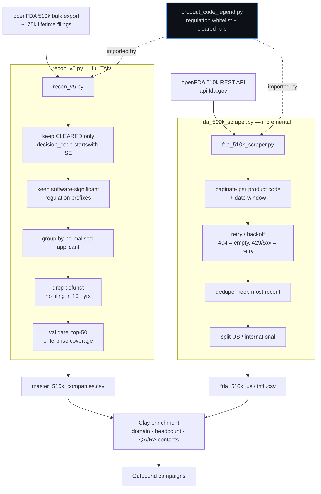
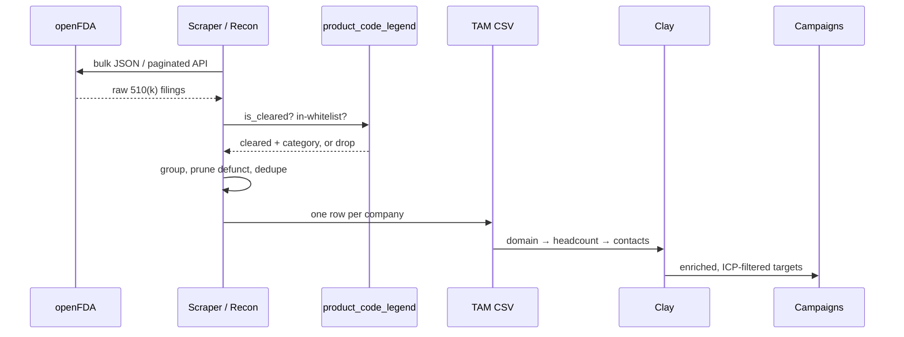

# FDA 510(k) SaMD Scraper

> Turns the entire FDA medical-device clearance record into a clean, deduplicated **Total Addressable Market** of companies that actually carry a software compliance burden — `174,888` lifetime filings in, `~5,000` real target companies out.

Internal go-to-market tooling built at **Astris Partners** for **Inferon Health**, an AI-native compliance-automation platform for medical-device makers. The job: find every company that has cleared a *software-significant* device with the FDA, because those are the companies living under IEC 62304 / ISO 14971 / 21 CFR 820 documentation obligations — the exact pain Inferon removes.

<sub>**Sanitization note:** this is a portfolio copy of production code. The openFDA API key is stubbed to `OPENFDA_API_KEY_XXX`, and the client is shown under the fictional name *Inferon Health*. All logic, the regulation whitelist, the filters, the API contract, and the real scale are unchanged.</sub>

---

## What's in here

| File | Role |
|---|---|
| `recon_v5.py` | **Bulk TAM build.** Offline pass over the full openFDA 510(k) export → one row per company. The centerpiece. |
| `fda_510k_scraper.py` | **Live API puller.** Targeted, date-bounded clearance pulls by product code (e.g. "everyone cleared in the last 12 months"). |
| `product_code_legend.py` | **Classification source of truth.** The software-significant product-code set *and* the CFR-21 regulation-prefix whitelist, with the rationale for every inclusion and carve-out. Both other scripts import from it. |
| `requirements.txt` | `requests`, `pandas`, `python-dateutil`. |

---

## Architecture



## Data flow, end to end



---

## Engineering decisions & tradeoffs

Everything below is in the code, not aspiration.

**Regulation prefixes, not a hand-curated code list.** A three-letter product-code whitelist (`QIH`, `LLZ`, …) is what most people reach for, and it's what the early versions used. The problem is the FDA mints new codes constantly for novel SaMD, so a curated list silently rots and under-counts. `recon_v5.py` instead matches on the **CFR-21 regulation-number prefix** (`892.x` radiology, `870.x` cardiac, `862.x` clinical chemistry…) via `REGULATION_WHITELIST`, whitelisting whole structural branches and carving out the hardware-only sub-sections in `EXCLUDE_PREFIXES` (e.g. `870.1` cardiac catheters, `892.57` radioactive sources). The taxonomy is stable; the code list isn't. The targeted puller keeps the curated codes because there speed and precision matter more than completeness.

**`decision_date` is a trap.** It marks *any* FDA decision, including denials — not a clearance. The cleared set is the "substantially equivalent" family, captured with `decision_code.startswith("SE")` (`is_cleared()` in the legend). Filtering on the exact string `SESE` instead — which an early version did — quietly drops `SESD`, `SESI`, `SEKN` and undercounts. On a full pull that's `171,467` cleared out of `174,888`.

**Two tools, one classification brain.** `recon_v5.py` is offline and reads the bulk export (one big batch, no rate limits, full lifetime history); `fda_510k_scraper.py` hits the live API for incremental, date-bounded, signal-driven pulls. They share `product_code_legend.py` so "what counts as a target" is defined in exactly one place.

**Coverage validation is the test, not vibes.** A whitelist is only trustworthy if it catches the obvious giants. `recon_v5.py` independently ranks the **top 50 lifetime enterprise filers across the entire dataset** and asserts they survive into the final TAM, printing any misses by name. If Intuitive Surgical, Brainlab, Varian or Stryker fall out, the whitelist is too narrow and you widen it — the run literally tells you. The production run hit `50/50`.

**Defunct pruning over a hard size cap.** Rather than guess at headcount from FDA data (which doesn't carry it), the dormant test is behavioural: no cleared filing in 10+ years ⇒ drop. Recency is then emitted as a *column*, not a gate, so downstream Clay enrichment can make the final live/dead call after it sees the website and employee count.

**Enrichment is deliberately not here.** The FDA `contact` field is a name only — no email, no title, often a one-time regulatory consultant. So the scrapers stop at *company + address + device* and hand off to Clay for domain → headcount → actual VP-level QA/RA buyer. Trying to treat the filing contact as the buyer is the classic mistake; the pipeline avoids it by design.

**Light name key, not entity resolution.** `normalise_company()` lowercases, strips legal suffixes (`Inc`, `GmbH`, `S.r.l.`…) and punctuation so filing variants collapse to one row. It intentionally does **not** resolve subsidiaries (e.g. parent-branded divisions) — that's a judgement call left to Clay, because over-merging here would silently delete independently-branded acquisitions that are valid targets.

**API key optional by construction.** openFDA keys are free and only raise the rate limit (240 → 1,000 req/min). The puller reads the key from an env var, omits the param entirely when it's the placeholder, and runs fine without one — so the repo is safe to publish and the tool still works on a clone.

---

## Run it

```bash
python3 -m venv .venv
source .venv/bin/activate
pip install -r requirements.txt
```

**Full TAM** (drop the openFDA bulk export in `~/Downloads/device-510k-0001-of-0001.json` first):

```bash
python3 recon_v5.py
```

**Incremental pull** from the live API:

```bash
python3 fda_510k_scraper.py            # last 12 months
python3 fda_510k_scraper.py 18 6       # 18 months ago → 6 months ago
```

**Print the classification reference:**

```bash
python3 product_code_legend.py
```

---

## Productionisation & known limitations

Honest about what this is and isn't.

- **510(k) only.** De Novo and PMA devices live in separate openFDA endpoints and won't appear. Some genuine SaMD (e.g. autonomous-AI diagnostics cleared via De Novo) is therefore missed — a known, accepted gap for a 510(k)-anchored TAM. A `pma.json` sibling of `recon_v5.py` is the natural extension.
- **`regulation_number` dependency.** Classification keys off `openfda.regulation_number`; a filing missing that field is skipped rather than guessed. Coverage is high but not 100%.
- **Name normalisation is heuristic.** No fuzzy matching or canonical entity graph — close-but-not-identical applicant strings can produce two rows. Tolerated because Clay dedupes again on enriched domain.
- **No scheduler.** This is run-on-demand. Productionising means a monthly cron against the refreshed bulk file and a diff against the prior TAM to emit *new* clearances as a buying signal.
- **US-only.** FDA data is US-market by definition. The Western-Europe equivalent needs a different spine (funding databases + company sites; EUDAMED coverage is too thin to source from) and is out of scope here.
- **No tests committed.** The `recon_v5` validation block (top-50 coverage, distribution prints) is the de-facto regression check; a proper suite would assert the cleared-filter and prefix-matcher on fixtures.

---

## Stack

`Python 3` · `requests` · `pandas` · `python-dateutil` · openFDA 510(k) API + bulk export · downstream: Clay
