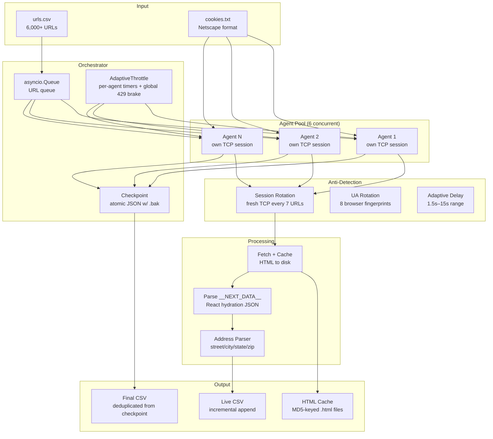

# IMDbPro Company Scraper

Async Python scraper that extracts structured company data (contact info, categories, popularity rankings) from 6,000+ IMDbPro company pages. Built to run against a paid IMDbPro subscription using exported browser cookies for authentication.

> **Sanitization note:** This is production code from a client engagement in the entertainment/media industry. All client-identifying information has been removed. Cookie values, session tokens, and target URL lists are excluded via `.gitignore`. The scraper logic, architecture, and all engineering decisions are preserved exactly as deployed.

---

## What It Does

Given a CSV of IMDbPro company URLs, the scraper extracts:

- Company name, category (Production, Distribution, etc.), COMPANYmeter rank
- Website, phone, email
- Physical address (parsed into street, city, state, zip, country)
- Key staff count, known-for/client count
- Branch/office locations

Outputs a live-updating CSV (rows written as each URL completes) plus a deduplicated final CSV from the checkpoint.

---

## Architecture



---

## Request / Data Flow

```
1. Load & deduplicate URLs (CSV auto-detect, normalize to pro.imdb.com)
2. Load checkpoint → filter out already-completed URLs
3. Shuffle remaining URLs (avoid sequential-page detection)
4. Launch N agent coroutines, each with staggered start (1–3s apart)
5. Per agent, per URL:
   a. Check HTML cache → skip network if cached
   b. Create fresh aiohttp session every 7 URLs (anti-tarpit)
   c. Respect per-agent adaptive delay (independent timer, no shared lock)
   d. GET the URL with rotated User-Agent, IMDbPro cookies, browser-like headers
   e. On 200: cache raw HTML to disk, parse __NEXT_DATA__ JSON
   f. On 429: report to global throttle (all agents slow down), sleep, retry once
   g. On timeout: increment timeout counter → 2 consecutive triggers session rotation
   h. Write result to live CSV immediately
   i. Update checkpoint (atomic: tmp → fsync → .bak rotate → replace)
6. On completion or Ctrl+C: save checkpoint, write deduplicated final CSV
```

---

## Engineering Decisions & Tradeoffs

### Per-agent session rotation vs. shared connection pool

**Problem:** IMDbPro tarpits (holds TCP connections open indefinitely with no response) after ~10 requests from the same TCP session. This was consistent across every configuration — 4 agents, 10 agents, 1-second delays, 6-second delays — the wall hit at exactly 9–10 requests every time.

**Decision:** Each agent creates and destroys its own `aiohttp.ClientSession` every 7 URLs. `force_close=True` on the TCP connector ensures no connection reuse.

**Tradeoff:** Session creation overhead (~1s teardown + 2–5s post-rotate pause) reduces theoretical throughput by ~15%. But the alternative was 100% failure after URL 10, so the effective throughput went from zero to ~75 URLs/min.

### Independent per-agent timers vs. shared lock throttle

**Problem:** The original design used a shared `asyncio.Lock` around a single `last_request_time`. Every agent waited in line to acquire the lock, slept while holding it, then released — effectively serializing all agents to one request per delay interval regardless of agent count.

**Decision:** Each agent tracks its own `_agent_timers[agent_id]` timestamp. No lock needed for sleeping. The shared lock is only held briefly when updating delay parameters on 429s (a global brake that slows all agents simultaneously).

**Tradeoff:** Agents can momentarily burst if their timers align. Acceptable because the per-agent delay (3.5s) is conservative enough that occasional alignment doesn't trigger rate limits.

### `__NEXT_DATA__` JSON parsing vs. HTML DOM scraping

**Problem:** IMDbPro is a Next.js/React app. The rendered HTML contains no contact data in DOM elements — everything lives in the `__NEXT_DATA__` script tag as a JSON hydration payload.

**Decision:** Regex-locate the `<script id="__NEXT_DATA__">` tag, extract the JSON blob between `>` and `</script>`, parse with `json.loads`, then navigate the nested structure (`props.pageProps.data.company`).

**Tradeoff:** Tightly coupled to IMDbPro's internal data schema. If they restructure the JSON, the parser breaks silently (fields return empty, not errors). Mitigated by per-field `try/except` blocks — one field failing doesn't cascade to others.

### Per-field error isolation

**Problem:** Early version wrapped the entire contact-info extraction in a single `try/except`. If `emailAddress` was `null`, the exception killed website, phone, and address extraction too.

**Decision:** Every field (website, phone, email, address) gets its own `try/except` block. A null email doesn't prevent extracting a valid phone number from the same branch node.

### Atomic checkpoint with backup rotation

**Problem:** JSON checkpoint file could corrupt on crash mid-write (partial JSON = unreadable on resume = lose all progress).

**Decision:** Write to `.tmp` → `fsync()` → rotate existing checkpoint to `.bak` → `os.replace()` tmp to primary. On load, try primary first, fall back to `.bak`.

**Tradeoff:** Two extra filesystem operations per checkpoint save. At `CHECKPOINT_EVERY=10`, this adds negligible overhead (~10ms per save on SSD).

### Outer watchdog timeout vs. inner request timeout

**Problem:** The inner `aiohttp.ClientTimeout(total=20, sock_read=12)` handles normal slow responses. But tarpits can stall at the TCP level before `sock_read` even starts, and 429 backoff sleeps happen inside the fetch loop — a legitimate 429 retry could take 30+ seconds.

**Decision:** Two-tier timeout: inner timeout (20s) for normal requests, outer watchdog (120s) around the entire `process_url` call. The outer timeout is deliberately generous to accommodate 429 backoff without false-positive cancellation.

**Tradeoff:** A truly tarpitted URL can waste up to 120s of an agent's time before the watchdog kills it. Acceptable because session rotation (triggered after 2 consecutive timeouts) resets the agent's TCP state, and the URL is checkpointed as an error for optional retry later.

### Incremental CSV vs. batch-at-end

**Decision:** Each result is appended to the live CSV immediately inside the process_url lock. A separate final CSV is written from the checkpoint (deduplicated) on completion.

**Tradeoff:** File I/O on every URL. At ~75 URLs/min, this is one `open()/write()/close()` per second — trivial. The benefit: user can `tail -f` or `wc -l` the CSV to monitor progress in real time, and partial results survive a crash even if the checkpoint write hasn't triggered yet.

---

## Productionisation / Known Limitations

- **Auth dependency:** Relies on browser cookies exported in Netscape format. Cookies expire (typically 24–48 hours), requiring manual re-export. A productionised version would use Playwright or a headless browser to maintain a persistent authenticated session.
- **Schema brittleness:** The `__NEXT_DATA__` JSON structure is an internal implementation detail of IMDbPro's Next.js app, not a stable API contract. Any frontend deploy can change the nesting. Monitoring would need a canary check (parse a known company, verify expected fields) before launching a full run.
- **No proxy rotation:** All requests originate from a single IP. The session rotation workaround is effective for 6K URLs but wouldn't scale to 50K+ without residential proxy rotation.
- **Address parsing is heuristic:** The `_parse_address` function uses regex pattern matching (2-letter state codes, 5-digit zips, positional heuristics). It handles US addresses well but degrades on international formats. A production system would use a geocoding API (Google Places, Smarty) for structured address parsing.
- **Single-machine only:** The asyncio queue doesn't distribute across workers. For larger scale, the URL queue would move to Redis/SQS with distributed checkpoint storage.
- **Rate limit detection is reactive:** The adaptive throttle responds to 429s and timeouts after they happen. A proactive approach would track request timestamps in a sliding window and preemptively slow down before hitting the threshold.
- **No deduplication across runs:** If the same URL appears in multiple input files across separate runs, both results end up in the checkpoint. The final CSV deduplicates by URL within a single run but not across runs.

---

## Usage

```bash
# Install dependencies
pip install aiohttp beautifulsoup4 lxml

# First run
python imdbpro_scraper.py -i urls.csv -c cookies.txt

# Resume after crash or interruption
python imdbpro_scraper.py -i urls.csv -c cookies.txt --resume

# Re-parse cached HTML with updated parser (no network)
python imdbpro_scraper.py -i urls.csv --reparse

# Tune concurrency
python imdbpro_scraper.py -i urls.csv -c cookies.txt --agents 8 --delay 3.0
```

### Input

- `urls.csv` — CSV with an auto-detected URL column (looks for `url`, `link`, `imdb`, `href` in headers, falls back to first column). Also accepts plain text files with one URL per line.
- `cookies.txt` — Netscape-format cookie export from a logged-in IMDbPro browser session. Must contain `at-main` (auth token), `session-token`, `ubid-main`, and `session-id`.

### Output

- `imdbpro_results.csv` — Live-appended results (one row per URL as it completes)
- `imdbpro_results_final.csv` — Deduplicated results from checkpoint (written on completion)
- `html_cache/` — Raw HTML pages keyed by MD5 of URL (enables `--reparse`)
- `checkpoint.json` — Crash-safe progress file (atomic writes with `.bak` rotation)
