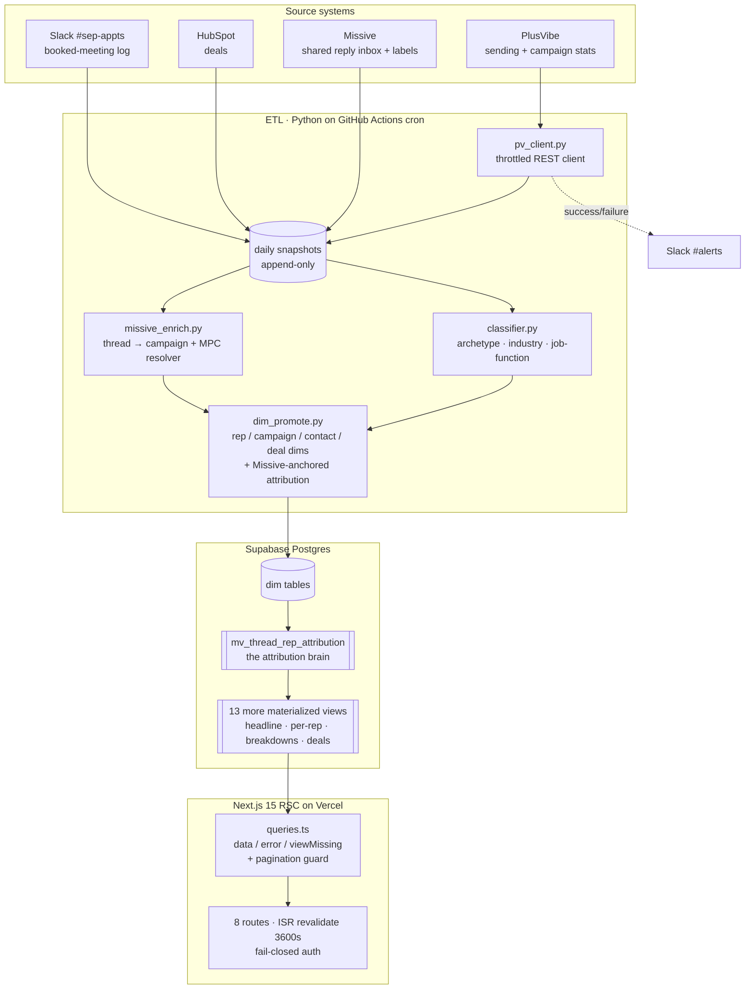
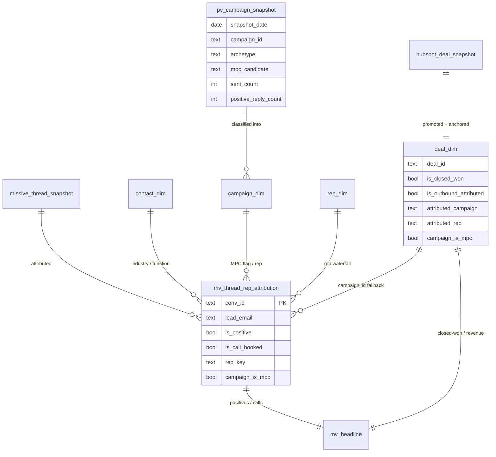
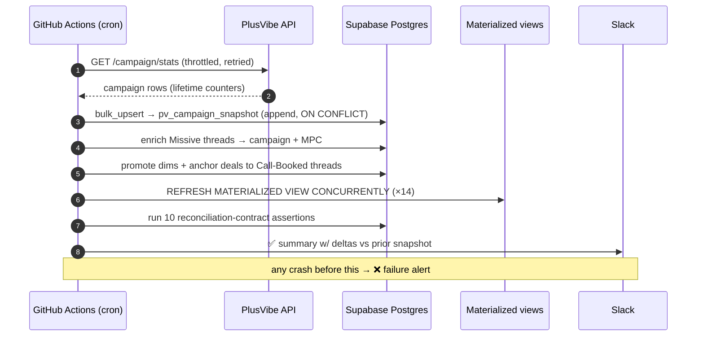

# Live Outbound Dashboard

**A daily-refreshed analytics dashboard that rebuilds a recruiting firm's entire cold-email funnel — sent → replied → positive → meeting booked → closed-won placement — from three systems that don't agree with each other, and makes every headline number traceable back to the row that produced it.**


It replaced a hand-built PDF report that went stale the day it was sent — and reconciles to that trusted PDF within ±1–4 on every funnel metric.

> **Sanitization note.** Real production tooling I built at Astris Partners. All logic, control flow, API contracts, and real scale are preserved. Confidential values are stubbed: the client is the fictional **Summit Executive Partners (SEP)**; rep and candidate names are fictional stand-ins applied consistently; dollar figures are rounded/illustrative; secrets are `.env` placeholders; the Supabase project ref and PlusVibe workspace id are redacted to `*_XXX`. Third-party platforms (PlusVibe, Missive, HubSpot, Supabase, Slack) are shown as-is. Where a value was redacted, the file says so.

---

## TL;DR

- **Three sources, one funnel.** PlusVibe (sending), Missive (the shared reply inbox where humans triage interest), and HubSpot (deals) are ETL'd nightly into Supabase Postgres and rebuilt into **14 materialized views**.
- **Attribution is the hard part.** A four-rung rep waterfall + a Missive-anchored deal model recovered placements the old "HubSpot contact filter" silently dropped — closing a **~$459K under-report** on campaign-level revenue.
- **Numbers you can trust.** Every windowed metric in the web app re-derives from base tables and is asserted to match its materialized view; the whole funnel reconciles to the legacy PDF baseline within **±1–4**.
- **Built to not break.** Append-only daily snapshots, graceful "view not ready" states, fail-closed auth, and sanitize-at-the-server-boundary so internal taxonomy never reaches the client.

## By the numbers *(sanitized scale — figures rounded/illustrative)*

| | |
|---|---:|
| Emails sent (lifetime, across ~360 campaigns) | ~330K |
| Replies received | ~5.8K |
| Positive replies (Interested ∪ Call Booked) | ~740 |
| Meetings booked | ~340 |
| Closed-won placements (outbound-attributed) | ~26 |
| Attributed revenue | ~$670K |
| Sales reps tracked | 6 |
| MPC candidates tracked | ~150 |
| Materialized views | 14 |
| Dashboard routes | 8 |

---

## The problem

The client runs cold-email recruiting campaigns: thousands of sends a week, replies triaged by hand in a shared Missive inbox, deals tracked in HubSpot. Once a quarter, someone stitched it into a PDF by hand.

That PDF had three failure modes:

1. **It was stale on arrival** — a point-in-time snapshot that never updated.
2. **The numbers didn't reconcile.** The funnel was assembled from three tools that don't agree on what a "positive" or a "booked call" is, and nobody could trace a headline number back to its source rows.
3. **Attribution was lossy.** Closed-won deals were matched to outbound by a brittle HubSpot filter that counted **2** of the real placements and silently dropped the rest.

The goal: a dashboard that refreshes daily, reconciles to the trusted baseline, and lets you trace any number back to the thread or deal that produced it.

---

## Architecture



### Data model



### One daily cycle



---

## How the funnel reconciles

The headline isn't a single query — it's three grains that have to agree:

- **Positives / calls** come from `mv_thread_rep_attribution` as `count(distinct lead_email)` over the trusted Missive labels (`Interested` ∪ `Call Booked`). A thread is positive because a human labelled it, not because an LLM guessed.
- **Sent / replied** come from PlusVibe's lifetime campaign counters (explicitly *not* date-sliced — see limitations).
- **Closed-won / revenue** come from `deal_dim`, but only deals flagged `is_outbound_attributed` — never the client's referrals or retainer book.

The web app's date-filtered paths (`*ByRange`) deliberately **re-derive** each number from the base tables in JS and are written to match the matview's aggregation *exactly* (same distinct key, same MPC scope). A 10-assertion reconciliation-contract test suite fails the build if any drift appears. Net result: the rebuilt funnel matches the legacy hand-built PDF within **±1–4** on positives, calls, the MPC/non-MPC split, and per-rep counts.

---

## Engineering decisions & tradeoffs

Each is in the code in this folder unless noted.

- **GitHub Actions over a hosted workflow runner.** The first version ran on n8n on a free Render tier and kept OOM-ing on the ~37 MB accounts pull. Actions runners give 7 GB RAM and a 6-hour ceiling for free, and the jobs are plain `python -m etl.<job>`. *(`.github/workflows/pv-campaigns-daily.yml`.)*
- **`pg8000` (pure-Python driver).** No native build step on the runner — no `psycopg2` wheel/compiler surprises in CI. *(`etl/db.py`.)*
- **Bulk upsert with a param-ceiling guard.** Postgres caps bind params at 65,535 per statement, so `bulk_upsert` auto-chunks to `60000 // len(cols)` rows and pre-dedupes by the conflict key — a duplicate id would otherwise throw `21000` and fail the whole batch. *(`etl/db.py`.)*
- **A throttled, browser-spoofing API client.** PlusVibe sits behind Cloudflare (blocks the default Python UA) and rate-limits ~5 req/s. The client sets a browser-ish UA, sleeps 0.21 s between calls, and retries 429/5xx with exponential backoff. *(`etl/pv_client.py`.)*
- **Append-only snapshots, not mutate-in-place.** A dated snapshot per day makes every historical funnel reproducible and turns "new campaigns since yesterday" / "Δ sent" into a `NOT EXISTS` / subtraction query. *(`etl/pv_campaigns.py`.)*
- **One attribution brain, read everywhere.** `mv_thread_rep_attribution` resolves the rep (a four-rung waterfall: Slack-booked → candidate→MPC-rep → campaign rep → Missive author) and the MPC flag once, per thread. Every per-rep view and the date-filtered JS paths read from it, so attribution logic lives in exactly one place. *(`sql/dashboard_views.sql`.)*
- **Missive-anchored deal attribution.** Deals are matched to outbound by anchoring on the actual Call-Booked thread (and inheriting its campaign via email-then-domain), not a HubSpot contact filter. This recovered the placements the old method dropped and closed a **~$459K** campaign-revenue under-report — with domain-only fallbacks gated and flagged after an audit found a stale bulk-import cluster. *(`sql/dashboard_views.sql`, Step-E views.)*
- **`REFRESH ... CONCURRENTLY` + a unique index on every view.** Refreshes never lock out dashboard readers. *(`sql/dashboard_views.sql`.)*
- **Materialized views + ISR.** The dashboard never computes the funnel at request time — it reads pre-aggregated `mv_*` views, and each RSC route is `revalidate = 3600`. Daily ETL + hourly cache keeps Supabase reads near zero.
- **Graceful "view not ready."** Every query helper returns `{ data, error, viewMissing }` (keying off Postgres `42P01`), so a page whose matview hasn't materialized shows a "setting up" state instead of crashing. *(`web/queries.ts`.)*
- **A pagination guard that prevents silent undercounts.** PostgREST caps a single response at ~1000 rows; the windowed aggregations read *every* matching row and count in JS, so a cap would halve a 3,600-row window's totals. `fetchAllRows` pages with `.range()` until the page is short. *(`web/queries.ts`.)*
- **Sanitize at the server boundary, not the render layer.** Internal campaign names carry an ops-taxonomy prefix (`Recruiter Scrape | …`). Stripping it only at render still leaked the raw string into the serialized RSC payload, so the fix sanitizes **before serialization** and trims the shipped column set. *(`web/format.ts` is the label sanitizer; `web/queries.ts` ships an explicit client-safe column list.)*
- **Fail-closed auth.** The dashboard serves prospect PII, so middleware redirects to `/login` when the gate password is unset in production rather than serving unauthenticated. The service-role key is read only in `server.ts` behind an explicit `{ admin: true }` flag and never reaches the browser. *(`web/server.ts`.)*

---

## Productionisation & known limitations

Honest about what's solid and what isn't:

- **Lifetime vs. windowed metrics.** PlusVibe's `sent` / `replied` counters are lifetime and monotonic — shown as-is and **not** date-bounded. The trustworthy, window-bounded metrics are positives / calls / closed-won, which reconcile to the baseline within ±1–4.
- **Unkeyed positives.** ~97 genuine positive threads have a NULL lead email and drop from the distinct-email headline (they still count at the thread grain). A backfill (the `thread_email_backfill` CTE) recovers most; an explicit "unkeyed" bucket is the remaining follow-up.
- **Candidate name canonicalization.** First-name-only Missive comments produce near-duplicate candidates ("Trev"/"Trevor Aldridge"); the roster-based `canonicalize_candidate()` pass (`etl/classifier.py`) mostly folds these, not entirely.
- **Single-tenant.** Everything assumes one Supabase project / one client. No multi-tenant routing.
- **Secret hygiene is the standing risk** on any project like this: a service-role key must live only in server env, never in a committed file or the client bundle. In this portfolio copy every secret is a placeholder.

---

## What's in this folder

A curated, sanitized slice — the files that best show the engineering. The full production system is two private repos (a Python ETL package and a Next.js app); the two remaining large modules it references (`missive_enrich.py`, `dim_promote.py`) are described above rather than copied.

```
Live Outbound Dashboard/
├── README.md                         this file
├── .env.example                      every secret as a placeholder
├── .gitignore                        blocks .env, build artifacts, caches
├── etl/
│   ├── db.py                         pg8000 connect + chunked bulk_upsert
│   ├── pv_client.py                  throttled, retrying PlusVibe REST client
│   ├── pv_campaigns.py               daily snapshot pull + Slack delta summary
│   ├── classifier.py                 archetype · candidate canonicalization ·
│   │                                 industry & job-function cascades
│   └── slack.py                      non-fatal webhook helper
├── sql/
│   └── dashboard_views.sql           14 materialized views — attribution brain,
│                                     funnel reconciliation, campaign deciles
├── web/
│   ├── server.ts                     RSC Supabase client (anon + admin opt-in)
│   ├── queries.ts                    one helper per view · viewMissing ·
│   │                                 pagination guard · byRange reconciliation
│   └── format.ts                     client-safe campaign-label sanitizer
└── .github/workflows/
    └── pv-campaigns-daily.yml        the daily cron lane
```

**Stack:** Python · pg8000 · Supabase Postgres · GitHub Actions · Next.js 15 (RSC) · TypeScript · Tailwind CSS v4 · Recharts · @supabase/ssr · Vercel · PlusVibe · Missive · HubSpot · Slack.
