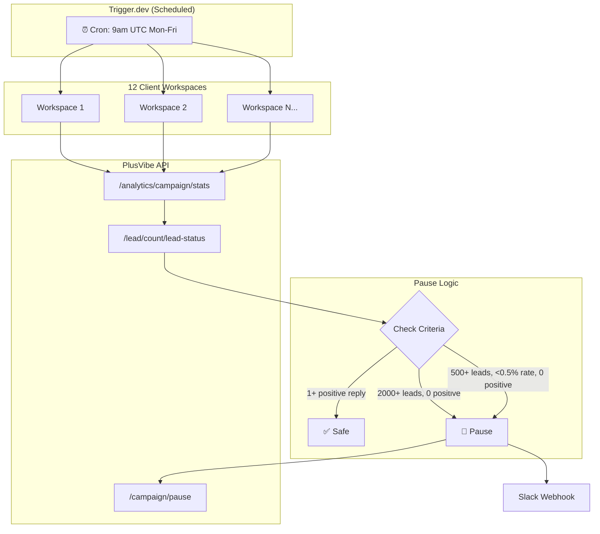

# Low Performing Campaign Automation

**Built at Astris Partners** — A scheduled automation that monitors email outreach campaigns across 12 client workspaces, automatically pausing underperformers to protect sender reputation and prevent wasted sends.

> ⚠️ **Sanitization Note**: API keys, webhook URLs, workspace IDs, and client names have been replaced with placeholders. All logic, control flow, and scale are preserved from production.

---

## What It Does

Runs Monday–Friday at 9am UTC via [Trigger.dev](https://trigger.dev), scanning all active campaigns across client workspaces and auto-pausing those that meet failure criteria:

| Condition | Action |
|-----------|--------|
| 2000+ leads contacted AND 0 positive replies | **PAUSE** |
| 500+ leads contacted AND <0.5% reply rate AND 0 positive replies | **PAUSE** |
| 1+ positive reply | ✅ **Safe** — never paused |

---

## Architecture



---

## Request / Data Flow

1. **Trigger.dev cron** fires at 9am UTC (weekdays only)
2. For each workspace:
   - **Step 1**: Fetch campaign list with today's date to find oldest `created_at`
   - **Step 2**: Fetch full stats using dynamic date range (oldest campaign → today)
   - **Step 3**: For each active campaign:
     - Skip if completed or >20% OOO/rescheduled leads
     - Check pause conditions
     - Call `/campaign/pause` if criteria met
     - Send Slack notification with formatted block message
3. Return summary: workspaces processed, campaigns checked, campaigns paused

---

## Engineering Decisions & Tradeoffs

### Dynamic Date Range (Two-Step API Call)

**Problem**: PlusVibe API requires `start_date` and `end_date` — but campaigns have different creation dates. Using a fixed date range would either miss old campaigns or return inaccurate stats.

**Solution**: First API call with today's date returns all campaigns with their `created_at`. Extract the oldest date, then make a second call with the full range. This ensures lifetime stats for accurate reply rate calculation.

**Tradeoff**: Two API calls per workspace instead of one. Accepted because accuracy matters more than speed for a daily scheduled job.

**Fallback**: If the first call fails, defaults to 3-year lookback (no campaign runs that long).

### Reply Rate = Replies / Leads Contacted (Not Emails Sent)

**Problem**: A campaign sending 3-email sequences would show artificially low rates if calculated as `replies / emails_sent`. A campaign contacting 1000 leads with 3 emails each shows 3000 sent — reply rate would appear 3x worse than reality.

**Discovery**: Debugged via terminal with `curl | jq` to compare API fields against PlusVibe UI. Found `lead_contacted_count` matches UI calculation, not `sent_count`.

**Result**: Prevents false positives that would pause healthy campaigns.

### Positive Reply Grace Period

**Problem**: A campaign with 0.3% reply rate but 5 positive (interested) replies is actually working — just has a long sales cycle or niche audience.

**Solution**: If `positive_reply_count >= 1`, campaign is never paused regardless of overall rate. One interested prospect is signal enough.

### OOO Detection

**Problem**: Campaigns during holiday periods show low engagement due to out-of-office auto-replies, not poor targeting.

**Solution**: Check `/lead/count/lead-status` for RESCHEDULED status (PlusVibe's term for OOO leads). Skip campaigns with >20% rescheduled leads — they're likely hitting a holiday period.

### Slack Block Formatting

**Decision**: Use Slack Block Kit instead of plain text for notifications.

**Reason**: Structured layout makes it scannable — campaign name, workspace, reason, and stats are visually separated. Operations team can triage at a glance without parsing a wall of text.

---

## Productionisation / Known Limitations

### Currently in Production

- ✅ Runs daily across 12 client workspaces
- ✅ Deployed on Trigger.dev with 15-minute max duration
- ✅ Slack notifications on every pause action
- ✅ Graceful error handling per workspace (one failure doesn't stop others)

### Known Limitations

1. **No Unpause Logic**: Paused campaigns stay paused. Manual review required to restart. Future: could add weekly digest of paused campaigns for review, or auto-unpause if positive replies come in.

2. **Single API Key**: All workspaces use the same PlusVibe API key. If key rotates, all workspaces affected. Future: per-workspace key storage in environment variables or secrets manager.

3. **No Backpressure**: If PlusVibe API rate-limits, individual workspace failures are logged but don't retry. Acceptable for daily job; would need exponential backoff retry logic for higher frequency.

4. **Threshold Hardcoded**: 0.5% reply rate threshold is in code. Future: could move to config file or per-client customization based on industry benchmarks.

5. **No Historical Tracking**: Doesn't store which campaigns were paused when. Future: log to database for analytics, trend detection, and "campaigns paused this week" reports.

6. **Timezone Assumption**: Runs at 9am UTC regardless of client timezone. Works for current client base but would need adjustment for APAC-heavy portfolio.

---

## Tech Stack

- **Runtime**: [Trigger.dev](https://trigger.dev) v3 (serverless scheduled tasks)
- **Language**: TypeScript
- **APIs**: PlusVibe (email campaign platform), Slack Webhooks
- **Scheduling**: Cron (`0 9 * * 1-5` — weekdays at 9am UTC)

---

## File Structure

```
Low Performing Campaign Automation/
├── README.md
├── src/
│   └── trigger/
│       └── scheduled.ts    # Main automation logic
├── trigger.config.ts       # Trigger.dev configuration
├── package.json
└── .gitignore
```

---

## Local Development

```bash
# Install dependencies
npm install

# Run locally (requires Trigger.dev CLI)
npm run dev

# Deploy to production
npm run deploy
```

Requires environment variables:
- `PLUSVIBE_API_KEY` — PlusVibe API authentication
- `SLACK_WEBHOOK_URL` — Slack incoming webhook for notifications
