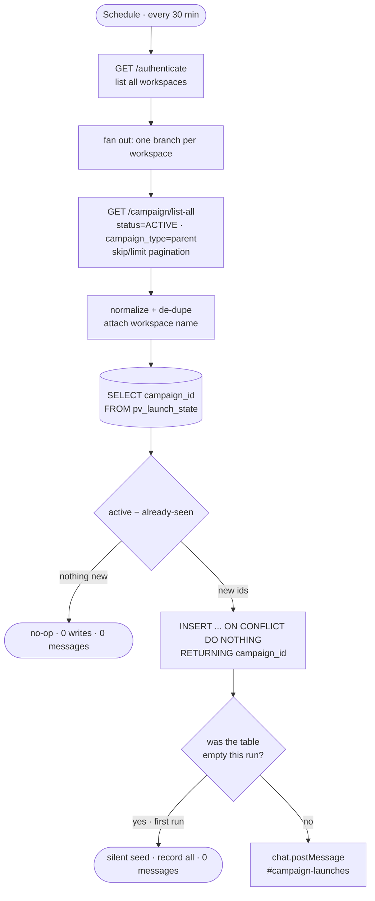

# Multi-Workspace Campaign Launch Alerts

A scheduled job that watches **every client workspace** on a cold-email platform
([PlusVibe](https://plusvibe.ai)) and drops a single Slack alert the moment a
campaign goes live — across ~120 concurrently-active campaigns spread over 12
workspaces, with **exactly-once** delivery and **zero backlog spam**.

> **Sanitization note.** This is real production tooling I built at a B2B
> sales-and-scheduling agency. All logic, control flow, API contracts, and the
> real 12-workspace / ~120-campaign scale are preserved. Confidential values are
> stubbed: client/workspace names and IDs are fictional stand-ins, secrets are
> `.env` placeholders, and platform credential IDs are redacted. The third-party
> platform (PlusVibe) and infra (Slack, Postgres) are shown as-is.

---

## The problem

Campaigns are launched **by hand**, in the platform UI, by a couple of operators,
across a dozen client workspaces. The team wanted a Slack ping the instant any
campaign went live — without anyone remembering to post it.

Two facts shaped the whole design:

1. **The platform has no "campaign launched" webhook.** Its webhooks only fire on
   replies and lead-label changes — nothing for campaign lifecycle. So a launch
   can only be *discovered*, not pushed.
2. **There is no reliable launch timestamp.** The `camp_st_date` field is almost
   always blank. The only trustworthy signal that a campaign launched is that its
   `status` is now `ACTIVE`.

So "detect a launch" becomes: **poll every workspace, diff the active set against
what we've already seen, and announce the new ones.**

A previous attempt at this shipped and was killed within a day — it **re-announced
the entire active backlog on every run** (~500 duplicate messages) because it had
no durable memory of what it had already sent. Avoiding that failure is the core
of this design.

---

## Architecture



Built and running in production as an **n8n** workflow (see
[`n8n/`](./n8n/campaign-launch-alerts.workflow.json)). This repo also ships a
**faithful standalone TypeScript reconstruction** of the same pipeline as a
[Trigger.dev](https://trigger.dev) scheduled task
([`src/trigger/`](./src/trigger/campaign-launch-alerts.ts)) so the logic is easy
to read without opening an n8n canvas.

---

## Data flow

1. **List workspaces** — `GET /api/v1/authenticate` returns every workspace the
   account-wide API key can see (12 of them). One key, all clients.
2. **List active campaigns per workspace** — `GET /api/v1/campaign/list-all` with
   `status=ACTIVE&campaign_type=parent`, paginated on `skip` until a page returns
   fewer than 100 rows. `parent` excludes sub-sequences so follow-ups don't fire
   alerts.
3. **Normalize** — flatten, de-dupe by id, and resolve each campaign's
   `workspace_id` to a human workspace name.
4. **Read state** — pull every `campaign_id` we've already announced from
   Supabase Postgres (`automation.pv_launch_state`).
5. **Diff** — `new = active − seen`.
6. **Record (race-proof)** — `INSERT ... ON CONFLICT DO NOTHING RETURNING`, so we
   only treat as "new" the rows this run actually created.
7. **Alert** — post one Slack message per genuinely-new campaign — **unless** the
   state table was empty at the start of the run (first deploy), in which case we
   record everything silently and send nothing.

---

## Engineering decisions & tradeoffs

**Durable dedupe in Postgres (Supabase), not in-memory.** The killed predecessor lost its
"already sent" set between runs and replayed the backlog. Here, a recorded
`campaign_id` is persisted forever, so an already-live campaign is *never*
re-announced. `SELECT`ing a few hundred ids per run is trivially cheap.

**Self-seeding first run.** On the very first execution the table is empty, so the
job records every currently-active campaign and sends **zero** messages; only
campaigns that appear *after* that ever alert. This makes the catastrophic
first-run spam *structurally impossible* — no manual backfill step to forget.
(If the table is ever wiped, worst case is a few missed alerts during the gap,
never a flood.)

**Insert-then-alert, driven off `RETURNING`.** Alerts are sent only for the rows
the `INSERT` actually created. Two overlapping runs therefore can't both "win" the
same campaign, so duplicates are impossible even under races. The deliberate
tradeoff: it favors *never duplicate* over *never miss* — if the Slack post fails
for a genuine launch, that one alert is lost rather than retried (the row is
already recorded). Given the operators' history of 500-message spam, no-duplicates
was the right priority.

**Polling cadence: every 30 min.** Launches are manual and low-volume, so the
load (one auth call + 12 list calls + two small queries per tick, ~3s) is
negligible — and a tick with nothing new is a complete no-op. The interval is a
single knob; tighten it to trade freshness for more runs.

**"Launched" = detection time.** Because the platform exposes no real launch
timestamp, the alert stamps **when the job detected the campaign live** — within
one poll interval of the actual click. It's labeled honestly rather than faking a
precise launch time.

**Per-workspace fault isolation.** Each workspace fetch is independently guarded:
one workspace erroring (or the platform rate-limiting) doesn't sink the run, and
because the job **never deletes** from the state table, a transient API failure
can only *delay* an alert to the next tick — it can never cause a false or
duplicate one.

---

## Repo layout

```
.
├── README.md
├── package.json
├── trigger.config.ts
├── .env.example
├── .gitignore
├── sql/
│   └── schema.sql                          # state table DDL
├── src/
│   └── trigger/
│       └── campaign-launch-alerts.ts       # standalone TS reconstruction
└── n8n/
    └── campaign-launch-alerts.workflow.json # sanitized production workflow export
```

---

## Sample alert

```
🚀 New campaign launched
Client / Workspace: Sourceflow
Campaign: Apparel Brands — Founder Persona — Generic Inboxes
Status: ACTIVE  ·  Leads: 1536  ·  Sequence steps: 2  ·  Daily limit: 800
Launched: 2026-06-08 14:19 UTC
```

*(fictional client/campaign — see sanitization note)*

---

## Tech stack

- **TypeScript** on **Trigger.dev v3** (`schedules.task`) for the standalone version
- **n8n** for the production workflow (Schedule → HTTP → Code → Postgres → Slack)
- **Supabase** (managed PostgreSQL) for durable dedupe state — the table lives in
  its own `automation` schema, isolated from product tables
- **PlusVibe API** (cold-email platform) as the source of truth
- **Slack Web API** (`chat.postMessage`) for delivery

---

## Productionisation & known limitations

- **Slack-failure visibility.** A failed Slack post is currently swallowed
  (favoring no-duplicates). In production this is paired with a global n8n error
  workflow that pings an ops channel on any run failure; the standalone version
  surfaces it via Trigger.dev run logs.
- **No exact launch timestamp.** The platform doesn't expose one, so the alert
  reports detection time (≤ one poll interval of the real launch).
- **Pagination ceiling.** Capped at 50 pages/workspace (5,000 active campaigns) —
  far beyond real usage; new launches sort newest-first and surface immediately.
- **Pause → resume does not re-alert.** Only the first activation fires, by
  design. Flipping that is a one-line change (delete the row when a campaign
  leaves `ACTIVE`).
- **Timezone.** Stamps UTC; localizing is a formatting change.
- **State growth.** ~1 row per real launch (a few hundred/year). A periodic prune
  of `COMPLETED`/`ARCHIVED` ids would keep it tidy long-term.

---

## Local run (standalone TS)

```
npm install
cp .env.example .env   # fill in real values locally — never commit .env
psql "$DATABASE_URL" -f sql/schema.sql
npx trigger.dev@latest dev
```
