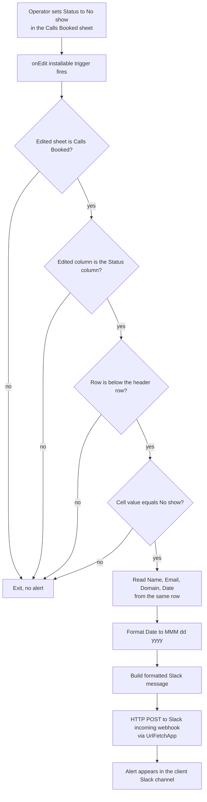

# No-Show Slack Automation

A Google Apps Script that posts a real-time Slack alert the moment a booked call is marked **No show** on a client's call-tracking spreadsheet.

This is **one script used as a repeatable process across multiple clients.** Each client at Astris Partners has its own call-tracking ("scorecard") spreadsheet. The identical script is bound to each one, and only the `CONFIG` block changes per deployment — client name, sheet/column layout, and Slack webhook. The same ~70 lines run across the entire client roster (≈10 scorecards at time of writing) rather than being rebuilt per client. Onboarding a new client is: copy the script in, edit `CONFIG`, install the trigger.

> **Sanitization note.** This is genuine production code. The real Slack webhook has been stubbed to `SLACK_WEBHOOK_URL_XXX`, and the client name has been genericised into the `CONFIG.CLIENT_NAME` value (`"<CLIENT_NAME>"`), which is set per deployment. All logic, control flow, column mapping, and the Slack message contract are unchanged from production.

## What it does

- Binds to a client scorecard spreadsheet via an **installable on-edit trigger**.
- Watches a single sheet (`Calls Booked`) and a single column (the booking **Status** column, col 8 / H).
- When an operator sets a row's status to exactly `No show`, it reads that row's **Name** (A), **Email** (B), **Domain** (C), and **Date** (F).
- Formats the date, builds a Slack-formatted message, and POSTs it to a Slack **incoming webhook**, which drops the alert into the client's channel.
- Every other edit on the sheet exits immediately and silently.

## Architecture

## Request / data flow

1. An operator edits a cell anywhere in the bound spreadsheet.
2. The installable on-edit trigger fires `onEdit(e)` and passes the edit event.
3. Four guard clauses run cheapest-first and bail out unless the edit is on the `Calls Booked` sheet, in the Status column, below the header row, and equal to exactly `No show` (after trimming).
4. On a match, the handler reads the four fields from the same row by column index.
5. If the date cell is a real `Date`, it is formatted to `MMM dd, yyyy` in the script's timezone.
6. The fields are assembled into a Slack-formatted message string.
7. `UrlFetchApp` sends a single JSON `POST` (`{ "text": ... }`) to the client's incoming webhook; the response is logged.

## Engineering decisions & tradeoffs

- **One config-driven script, many clients.** Everything client-specific lives in `CONFIG` (name, sheet, column indices, trigger value, webhook), so the same file deploys everywhere. Tradeoff: each deployment is an independent copy with no shared library, so a logic change has to be re-propagated to every sheet.
- **Cheap-first guard clauses.** Because `onEdit` fires on *every* edit to the sheet, the handler exits in the order wrong-sheet → wrong-column → header-row → value-not-`No show`, before reading any other cells. The overwhelmingly common case (an unrelated edit) costs a couple of comparisons.
- **Exact, trimmed status match.** It fires only on an exact `No show` after `.trim()`, never a substring. Tradeoff: brittle to wording drift ("No-show", trailing characters); it relies on the Status column using data-validation/dropdown to stay canonical.
- **Installable trigger, not a simple one.** The alert calls an external service (`UrlFetchApp`), which a *simple* `onEdit` trigger cannot do because simple triggers run unauthorized. So it is wired as an installable on-edit trigger (confirmed in the Triggers panel, 0% error rate).
- **Incoming webhook over the Slack Web API.** A webhook is one `POST` with no OAuth, tokens, or scopes to manage — fast to stand up per client. Tradeoff: the webhook URL is itself a bearer secret and can only post to its single preconfigured channel (which suits the per-client model here).
- **Fail-soft on the POST.** `muteHttpExceptions: true` plus logging the response means a transient Slack error doesn't throw a red error onto the operator's edit; the body is logged for debugging instead. Tradeoff: a failed post is invisible to the operator (see limitations).

## Productionisation / known limitations

- **Secret lives in source.** `SLACK_WEBHOOK` is hardcoded in `CONFIG` (stubbed in this repo). Production-grade: store it in `PropertiesService` Script Properties and read it at runtime, so the secret never touches the file or the repo.
- **`onEdit` name + installable trigger can double-invoke.** Because the handler is literally named `onEdit`, Apps Script also runs it as a *simple* trigger; combined with the installable trigger, a single edit can call the function twice. The simple-trigger run fails at `UrlFetchApp` (unauthorized), so there's no duplicate Slack message — but it can produce phantom execution errors / daily failure-notification emails. Cleaner: rename the handler (e.g. `handleNoShowEdit`) and bind only the installable trigger. Worth confirming in the Executions log.
- **Column-index coupling.** Fields are read by fixed column numbers; reordering or inserting a column silently sends the wrong values. Resolving columns by header name would make it reorder-safe.
- **No dedupe.** Re-selecting `No show` on a row (or toggling back and forth) re-fires the alert. A processed-flag column or timestamp guard would make alerts idempotent.
- **No retry / dead-letter.** A non-200 from Slack is logged and dropped; the alert is lost. A small retry or a queue would harden delivery.
- **Operator-silent failures.** Tied to the fail-soft choice above — a failed delivery surfaces nowhere in the sheet. A lightweight status write-back would close that loop.

## Files

- `no-show-slack-alert.gs` — the script (sanitized)
- `.gitignore`
