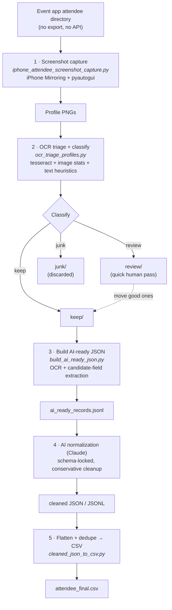

# Pixels to Prospects

An end-to-end pipeline that turns a conference **attendee directory locked inside
an event app — with no export and no API** — into a clean, deduplicated CSV of
structured leads. It does this by capturing each profile as a screenshot,
OCR-ing them, triaging real profiles from UI junk, handing the messy OCR to a Claude
step for schema-locked normalization, and flattening the result to CSV.

The name is the whole job in three words: on-screen profiles (pixels) come out the
other end as a usable prospect list.

> **Sanitization note.** This is a redacted copy of a pipeline that ran in
> production. No credentials, tokens, or personal data are included, and all paths
> use a generic `~/Downloads` location. The only redaction is in
> `build_ai_ready_json.py`: the `ORG_HINTS` list originally contained a few
> specific exhibitor/vendor names from the target event (used as extra
> org-detection hints) — those have been removed and replaced with a note. The
> logic is otherwise exactly as it shipped.

---

## The problem

The attendee list existed only inside an event app's UI. No CSV export, no API,
inconsistent layout, variable row spacing, and a mix of record types (individual
attendees, exhibitor company pages, representatives). A naive "scrape it" approach
fails: screenshots come back blank, or showing menus, agendas, floor plans, and
search screens, and OCR output is too noisy for a rule-based parser to finalize
reliably. The pipeline is built around those realities rather than pretending they
don't exist.

## Pipeline



Stage by stage:

1. **Capture** — automates iPhone Mirroring on a Mac to click through each visible
   attendee row, open the profile, screenshot a calibrated region, and go back.
2. **Triage** — OCRs every screenshot and sorts it into `keep` / `review` / `junk`
   using image statistics and text signals, copying images into bucket folders and
   writing a JSONL record per image.
3. **Build AI-ready JSON** — re-OCRs the kept screenshots and extracts structured
   *candidates* (likely name, location, booth, sliced sections, leftover lines)
   without trying to finalize the record.
4. **AI normalization** — a schema-constrained prompt (in this README) turns each
   AI-ready record into a clean, typed JSON object.
5. **CSV** — flattens arrays and nested representative objects, dedupes on text
   keys, and writes a wide CSV.

---

## Engineering decisions & tradeoffs

The interesting part is *why* it's shaped this way — every choice is a response to
a specific failure mode.

### 1. Screenshots + OCR, because there was no other door in
The data only existed in the app UI. With no export and no API, capturing the
rendered profiles and reading them back with OCR is the only reliable path to the
data. The pipeline accepts that and optimizes the capture rather than wishing for
an endpoint.

### 2. Calibrated, human-in-the-loop capture instead of blind auto-scroll
The app only responded reliably to a real two-finger scroll — programmatic scroll
was flaky. So the script automates the part that *is* deterministic (clicking
saved row coordinates, screenshotting a fixed region, pressing Back, with tuned
`open` / `back` / `settle` delays) and hands scrolling between batches back to the
human. A one-time `calibrate` step records exact row click points, the Back button,
the screenshot region, and the delays. **Tradeoff:** throughput is bounded by the
human scroll cadence, and calibration breaks if the mirroring window is moved or
resized — accepted in exchange for reliable, non-corrupted captures.

### 3. Three-bucket triage (keep / review / junk), not blind trust
Captures inevitably include blanks, menus, list views, agendas, floor plans, and
search screens. `classify_record` combines **image statistics** (gray mean and
standard deviation to catch mostly-white/blank frames, edge density as a
content-richness proxy) with **text signals** (junk-term vs profile-term hit
counts, role words, US-location presence, char/line counts, OCR confidence).
Strong profiles go to `keep`, clearly-UI frames to `junk`, and anything ambiguous
to `review` for a fast human pass — uncertain images are surfaced, never silently
dropped.

### 4. Python does the mechanical work; AI does the interpretation
This is the core architectural call. OCR output varied too much — inconsistent
spacing, broken lines, and genuinely mixed record types (a person vs. an exhibitor
*company* page that lists representatives) — for a rule-based parser to finalize
reliably. So `build_ai_ready_json.py` extracts structured *candidates* and slices
sections, but deliberately stops short of deciding the final record. It emits raw
text, cleaned lines, UI flags, detected sections, candidate fields, and a list of
*unresolved* lines, then hands that to an AI step. Python stays responsible for
capture, OCR, grouping, and file I/O — all the things code is good at — and AI
handles the nuanced field interpretation it's good at.

### 5. A conservative, schema-locked normalization prompt
The AI step is constrained, not freeform: a fixed output schema, explicit
"do not invent facts," "leave unclear values blank," "preserve uncertain leftovers
in `notes`," "keep `raw_text` unchanged," and rules for the person-vs-company
distinction (people tied to exhibitors stay people; exhibitor pages stay companies
and may carry representatives). That keeps the AI step auditable and prevents
confident hallucination.

### 6. Dedupe AFTER normalization, on text — never by image hash
Profile screens look nearly identical, so perceptual image hashing would merge
*different people* as duplicates. Dedupe therefore runs only after normalization,
on text keys: `company + location + booth` for company records, and
`name + company` or `name + location` for people, with a raw-text fallback. This
ordering is the difference between a clean list and one that quietly loses real
contacts.

### 7. Flatten everything for a boring, importable CSV
The final writer collapses arrays into `; `-joined strings and turns nested
representative objects into `name - title - company`, producing a wide, flat CSV
that drops straight into a spreadsheet or CRM import. Dedupe is on by default and
can be disabled with `--no-dedupe`.

---

## How to run

Dependencies:

```bash
brew install tesseract
python3 -m pip install pyautogui pillow pytesseract
```

On macOS, grant Terminal **Accessibility** and **Screen Recording** permissions
(System Settings → Privacy & Security).

Then the sequence:

```bash
python3 iphone_attendee_screenshot_capture.py calibrate
python3 iphone_attendee_screenshot_capture.py run
python3 ocr_triage_profiles.py
# manually move any good profiles from the review/ folder into keep/
python3 build_ai_ready_json.py
# feed ai_ready_records.jsonl to the AI normalization step (prompt below),
# saving cleaned chunks into ~/Downloads/attendee_ai_cleaned
python3 cleaned_json_to_csv.py
```

Default working folders all live under `~/Downloads` (screenshots → OCR output →
AI-ready → AI-cleaned → `attendee_final.csv`); every script takes `--input-dir` /
`--output-dir` overrides.

## AI normalization prompt

The schema-locked prompt fed between steps 3 and 5:

```text
You are cleaning OCR-derived attendee directory records from an event app.

I will give you JSON objects where each object contains:
- source_image
- raw_text
- clean_lines
- ui_flags
- sections
- candidate_fields
- unresolved_lines

Convert each object into a cleaner final JSON object with this schema:

{
  "source_image": "",
  "record_kind": "person|company|unknown",
  "subtype": "attendee|representative|contributor|exhibitor|unknown",
  "name": "",
  "credentials": [],
  "title": "",
  "company": "",
  "location": "",
  "booth": "",
  "session_info": "",
  "designations": [],
  "topics": [],
  "summary": "",
  "representatives": [],
  "urls": [],
  "notes": "",
  "raw_text": ""
}

Rules:
- Be conservative.
- Do not invent facts.
- Preserve uncertain leftovers in notes.
- If a value is not clear, leave it blank.
- People tied to exhibitors are still people, not companies.
- Company exhibitor pages should remain company records and may include representatives.
- Designations and credentials should be arrays.
- Topics should be arrays.
- Representatives should be an array of objects when possible.
- Keep raw_text unchanged.

Return only valid JSON.
```

---

## Files

| File | Role |
|---|---|
| `iphone_attendee_screenshot_capture.py` | Stage 1 — calibrated screenshot capture over iPhone Mirroring. |
| `ocr_triage_profiles.py` | Stage 2 — OCR + keep/review/junk classification. |
| `build_ai_ready_json.py` | Stage 3 — OCR + candidate-field extraction into AI-ready JSON. |
| `cleaned_json_to_csv.py` | Stage 5 — flatten + dedupe normalized JSON into the final CSV. |

## Tech stack

Python · `pyautogui` (UI automation) · `tesseract` / `pytesseract` (OCR) ·
`Pillow` (image stats) · schema-constrained Claude normalization · CSV output.

## Responsible use

Run this only against directories you're authorized to access, and comply with the
source app's terms of service and any applicable data-protection rules for the
contact data you collect.
