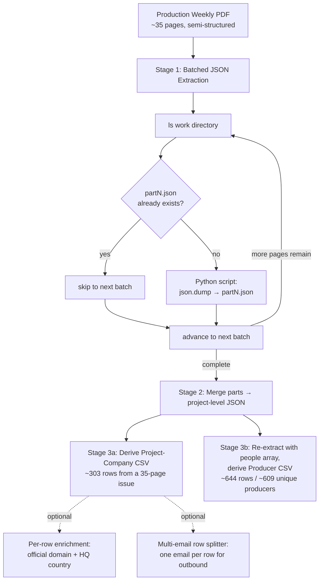

# Production Weekly PDF → Structured Outbound Data Pipeline

A six-prompt LLM extraction pipeline that converts a 35-page semi-structured trade-publication PDF into two clean outbound datasets: a **project-company CSV** (one row per project-company pair, with classified emails, parsed addresses, and country resolution) and a **producer-focused CSV** (one row per producer, with plausible person-email matching against company contact blocks). Built for weekly recurring extraction against new issues of the same publication.

Built at a B2B outbound agency for prospecting in the film and television production industry.

---

## The problem

Production Weekly publishes a weekly PDF of in-progress and upcoming film and TV projects. Each project listing carries company contact blocks, producer and writer-producer credits, shoot location, and status. Two distinct outbound datasets need to come out of every issue:

1. **Project-company outbound** — one row per project-company pair, deduped, with emails classified into "generic" inboxes (`info@`, `contact@`, `hello@`…) and personal inboxes, addresses parsed into structured fields with country resolution, and a fallback ranking when no production company is attached to a project.

2. **Producer outbound** — one row per individual producer, with name splitting that survives middle initials and suffixes, and person-email matching that's structurally plausible but never guesswork.

The technical bottleneck is mundane and consistent: a 35-page PDF doesn't fit in a single LLM extraction call. Single-pass attempts truncate mid-write when the model hits its output-token ceiling. The naive workaround — stream JSON literals across multiple tool calls — produces silent corruption when one call self-terminates mid-record.

## Architecture

## Engineering decisions & tradeoffs

### 1. Two-pass architecture (JSON-first, CSV-derived) over single-pass extraction

Extract a clean project-level JSON tree first — projects, companies, people, all relationships preserved — *then* derive flat CSVs from it. The temptation is to ask the LLM to emit the final CSV directly, but doing so collapses the company-to-project relationships too early. Once flattened, filtering rules like *"if a project has any `production_company`, drop the studios and finance companies for that project"* become impossible to express without losing fidelity.

**Tradeoff:** two LLM passes per issue instead of one. The cost is more than paid back by the derivation step being deterministic — any prompt change to the derivation logic re-runs against the JSON without re-extracting from the PDF.

### 2. Disk-persisted batched writes with `ls`-before-batch resume

The core production move. The naive pattern — have the LLM stream JSON literals across multiple tool calls — fails because output-token limits cut records in half mid-array. The fix inverts the relationship: instead of the LLM emitting JSON as its response, each batch has the LLM **write a small Python script** that constructs the data as dicts and calls `json.dump()` to disk at a deterministic path (`/home/claude/work/part1.json`, `part2.json`, …).

Critically, each batch begins by running `ls /home/claude/work/` and skipping any batch whose output file already exists. A model timeout, context exhaustion, or interruption mid-pipeline means the next invocation resumes from the next missing part — not from page one. The merge step at the end is a single Python pass that loads every `partN.json`, concatenates the `projects` arrays, validates the result parses, and writes the final deliverable.

This is the most useful production-LLM pattern in this pipeline. Most LLM extraction setups still hit the output-token ceiling and don't have a recovery path; this design makes the limit a non-event.

### 3. Email classification by `startswith`, not exact-match

Generic inbox addresses get classified separately from personal addresses because they're routed differently in outbound — warmup-safe and lower-priority for generics, personal high-signal sends for everything else. The first implementation matched the local part exactly against a prefix list: `info`, `admin`, `contact`, `hello`, `office`, etc.

That broke on real data the moment a multi-office company used `info.la@example.com` (still generic), or a production company used `production.silencedvoices@gmail.com` (still generic — the local part *starts with* "production"), or `productionpinch@gmail.com` (also generic). Exact-match returned all of these as personal, which would have routed them into the wrong outbound stream.

The fix is a `startswith` check against the prefix list. The rule explicitly **excludes** common-but-not-listed prefixes like `careers@`, `hr@`, `support@`, `jobs@` — those are deliberate non-generic categories that need their own routing, not generic-bucket folding.

### 4. Plausible person-email matching with a 3-character floor

The producer CSV attaches a personal email to each producer when one exists in the company's contact block — but only when the match is structurally defensible. The matching rule recognizes four patterns:

- first name (`john@…`)
- last name (`smith@…`)
- first initial + last name (`jsmith@…`)
- initials that clearly correspond to the producer's full name (`jas@…` for "John Allen Smith")

The matched component must be **at least 3 characters long**. This floor exists specifically because two-letter local parts (`jo@`, `al@`) collide too easily with unrelated employees, and a false-positive personal-email assignment is worse than a blank field — it routes a personal touchpoint to the wrong human and burns the conversation.

When two emails plausibly match, both are kept in `person_email_1` and `person_email_2` in listed order. When ownership is uncertain, the field is left blank by rule. The pipeline does not guess.

### 5. Eight international address parsers with a raw-fallback path

The address parser handles eight format families:

1. US canonical (`<street>, <city>, ST ZIP`)
2. US with missing city/state comma — split via street-suffix heuristic (St, Ave, Blvd, Rd, Pkwy, Way, Plaza, Ln, Ct, Hwy, …)
3. Canada (`<street>, <city>, PR A1B 2C3`)
4. Australia (`<street>, <city> STATE 0000`)
5. UK — anywhere containing a postcode matching `[A-Z]{1,2}\d[A-Z\d]?\s+\d[A-Z]{2}`
6. European postal-before-city (`<street>, <postal> <city>, <Country>` — France, Germany, Switzerland, Finland, Spain, Portugal, Italy)
7. Irish Eircode (`X00 XX00`)
8. Japanese hyphenated postal (`XXX-XXXX`)

When a format isn't recognized, the parser drops the raw address into `address_line_1` and leaves the structured fields blank — preserving the data for downstream lookup rather than discarding it. URL-only address fields (`example.com`, `example.com/contact`) are explicitly detected and left blank across all address columns; they're not addresses.

`country` is always derived from the company address, never from `project_shoot_location` — a US production shooting in Iceland still has its country set to the company's HQ country, not Iceland.

### 6. Company-type fallback ranking when no `production_company` is attached

When a project has one or more `production_company` entries, only those rows survive into the CSV for that project — the studios, networks, financiers, and agencies attached to the same project are dropped. This concentrates outbound at the company tier most likely to respond to vendor pitches.

When no `production_company` exists, the pipeline preserves exactly one fallback row using a strict ranking:

1. `project_specific_entity_or_spv`
2. `sales_or_finance_company`
3. `studio_or_network`
4. `agency_or_management`
5. `unknown`

Within a tied tier, `primary_listing_entity` wins; otherwise the first listed company. Projects with zero attached companies drop out entirely — no row, no blank-company placeholder.

### 7. Structural cleanup as a derivation rule, not a separate audit pass

The first version of the pipeline ran a separate "audit and repair" pass after CSV derivation to strip pipes, brackets, placeholder strings (`N/A`, `none`, `unknown`, `-`), and stray quote characters. The second version folded those rules into the derivation prompt itself.

The reason: an audit pass run *after* derivation has to *detect and fix* damage; a cleanup rule embedded in the derivation prompt prevents the damage from being introduced in the first place. Auditors fail when they miss a pattern; derivation rules fail when they're written ambiguously — and the second failure mode is much easier to debug and stabilize.

The validation block at the end of the derivation prompt is a final type-and-format check, not a repair pass. If a row violates the contract (a `company_type` outside the allowed set, a generic email that ended up in a personal column), the pipeline re-derives rather than patches.

### 8. Producer-line continuation rules tied to the source format

Producer credits in Production Weekly listings sometimes wrap across two lines — a trailing ` -` or a one-token continuation onto a capitalized next line. The extraction prompt handles both: it joins continuation lines before parsing, and it recognizes the full set of label terminators (`PRODUCER`, `WRITER/PRODUCER`, `EXECUTIVE PRODUCER`, `CO-PRODUCER`, `ASSOCIATE PRODUCER`, `LINE PRODUCER`, `WRITER`, `DIRECTOR`, `STATUS`, `LOCATION`, `CAST`, …) followed by `:` as the stop signal.

This is the most format-coupled part of the pipeline. If applied to a different trade publication, this is the section that gets re-derived against the new format's conventions.

## Pipeline files

| File | Purpose |
|---|---|
| `prompts/01-extract-projects-companies.md` | Stage 1 (company flow) — batched PDF → project-level JSON, with disk-resume execution rules |
| `prompts/02-derive-company-csv.md` | Stage 2 (company flow) — JSON → project-company CSV with email classification, address parsing, structural cleanup, and validation |
| `prompts/03-research-domain-country.md` | Stage 3 optional — per-row domain and HQ-country research, one record at a time |
| `prompts/04-split-multi-email-rows.md` | Stage 4 optional — multi-email rows → one row per email for outbound |
| `prompts/05-extract-projects-people.md` | Stage 1 (people flow) — re-extracts or augments the JSON with a `people` array filtered to producer / writer-producer roles |
| `prompts/06-derive-producer-csv.md` | Stage 2 (people flow) — JSON → producer-focused CSV with name splitting and plausible person-email matching |

## Output shape

For a single 35-page issue, this pipeline produces:

- ~147 distinct project listings captured in the JSON tree
- ~448 company records preserved across those projects
- ~303 project-company rows after fallback filtering and dedup
- ~644 producer rows / ~609 unique producers after name-splitting

## Post-derivation operator notes

These are the lightweight downstream steps run after the CSVs are out, useful as a checklist:

1. Standardize `country` values via an ISO code lookup column; filter to the operator's target region.
2. Concatenate the per-row emails into a single combined string column (or bake the concatenation into Prompt 2 directly — operator's call).
3. To produce a one-email-per-row outbound file, export the combined-email column and run Prompt 4 (`04-split-multi-email-rows.md`).

## Productionisation / known limitations

- **Tight format coupling.** The label terminator set and continuation rules are specific to Production Weekly's listing conventions. Adapting to a different trade publication requires re-deriving the label list, terminator set, and continuation heuristics. The two-pass architecture limits the blast radius — the extraction prompt is the only piece that needs to change.

- **Disk-resume requires persistent scratch storage.** The `partN.json` resume mechanic depends on `/home/claude/work/` (or equivalent) persisting across batches. In an ephemeral-per-call runtime, this needs adapting to a real object store (S3, R2, GCS) with the same deterministic naming convention.

- **Person-email matching is structural, not verified.** A producer named "John Smith" matching against `jsmith@company.com` is plausible — but the pipeline doesn't reach out to verify ownership. False positives are possible when a producer's name partially collides with a generic department prefix that happens to fit the four-pattern rule.

- **Address coverage is eight formats deep.** Latin American (Brazilian CEP, Mexican CP), Eastern European, Middle Eastern, and South/Southeast Asian formats fall back to the raw-into-`address_line_1` path. Adding any of these is a localized prompt change with no downstream impact.

- **No automated regression tests across issues.** The pipeline is reliable in practice but doesn't have a "known-good" reference extraction with row-count and field-distribution assertions that would catch silent prompt drift if the LLM provider changes default behavior. Adding one would make weekly runs verifiably stable.

- **The domain/country research stage is per-row by design.** Each call enriches one company. For high-volume runs this should be parallelized with rate-limit handling — the per-row design is currently a deliberate accuracy trade against batch hallucination.

---

> **Sanitization note.** No client names, API tokens, UUIDs, or real producer/company contact records are exposed by this repository. The prompts ship as-is — they contain no embedded credentials or proprietary data. The numerical output shapes above are representative of a single issue; specific issue contents and the agency that deployed this are not disclosed.
