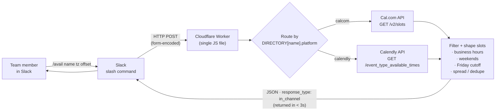

# Slack Availability Bot

A Slack slash command that returns a teammate's (or external partner's) upcoming
booking availability directly in the channel — pulling live from **two different
scheduling platforms (Cal.com and Calendly)** behind a single interface.

```
/avail kelvin gmt
```
```
Availability for Kelvin:

– Tuesday, Jun 17 — 9:00 am, 10:30 am, 1:00 pm, 2:30 pm GMT
– Wednesday, Jun 18 — 8:30 am, 10:00 am, 11:30 am, 2:00 pm GMT
– Thursday, Jun 19 — 9:00 am, 11:00 am, 1:30 pm, 3:00 pm GMT
```

> **Sanitisation note.** This repository is a redacted copy of code that ran in
> production. Client and teammate names, Cal.com usernames, Calendly user UUIDs,
> event-type IDs and API tokens have all been replaced with fictional,
> non-functional placeholders (anything marked `_XXX` or formatted as a dummy
> `00000000-…` UUID). The control flow, API contracts, filtering rules and
> formatting logic are exactly as they shipped — only the sensitive values are
> stubbed.

---

## What it does

A team member types `/avail [name] [timezone] [days_offset]` in Slack and gets
back, in under a second, a clean shortlist of when that person is free — up to
**3 working days**, each with up to **4 spread-out slots**, rendered in whatever
timezone the requester asked for.

| Argument | Required | Default | Example |
|---|---|---|---|
| `name` | yes | — | `darryl` |
| `timezone` | no | `est` | `gmt`, `pst`, `ist`, `cet` … |
| `days_offset` | no | `1` (tomorrow) | `14` (start two weeks out) |

The same command works whether the named person schedules on Cal.com or
Calendly — the caller never has to know or care which platform is behind a given
person. That abstraction is the core of the project.

---

## Architecture



The whole thing is **one stateless Cloudflare Worker** with no database, no build
step, and no third-party dependencies. A request comes in from Slack, the Worker
looks the person up in a config object, calls the right calendar API, filters and
formats the result, and replies — all within Slack's hard 3-second budget.

### Request lifecycle

1. **Slack → Worker.** The slash command sends a form-encoded `POST`. The Worker
   parses `text`, splits it into `name` / `timezone` / `days_offset`, and
   validates each (unknown name or timezone returns a helpful list instead of an
   error).
2. **Routing.** `DIRECTORY[name].platform` decides whether to call the Cal.com or
   the Calendly path. Everything downstream of the API call is shared.
3. **Cal.com path.** Hits `GET /v2/slots` with the user's `username` +
   `eventTypeSlug` and the requester's IANA timezone, over a 14-day window.
4. **Calendly path.** Resolves the user's event type, then hits
   `GET /event_type_available_times`. Auth is either the person's individual
   Personal Access Token or a shared org admin token (see below).
5. **Filter + format.** Both paths converge on one formatter that drops weekends
   and out-of-hours slots, applies the Friday cutoff, spreads the remaining slots
   so they're not clustered, and renders day/time strings in the requester's
   timezone.
6. **Worker → Slack.** Returns JSON with `response_type: in_channel`, so the
   result is posted visibly in the channel for the whole team to see.

---

## Engineering decisions & tradeoffs

This section is the interesting part — the *why* behind the shape of the code.

### 1. Cloudflare Workers, not n8n — because of Slack's 3-second timeout

The first version of this was built on **n8n hosted on Render's free tier**. It
worked in isolation but failed in Slack: Slack kills any slash-command response
that takes longer than **3 seconds**, and a free-tier instance that has scaled to
zero takes ~30 seconds to cold-start. The request was dead before the workflow
even woke up.

A Cloudflare Worker solves this structurally: it runs at the edge, stays warm,
and responds in well under 100ms. The free tier covers 100k requests/day, which
is far beyond what an internal scheduling helper will ever need.

**Tradeoff:** n8n's visual editor is friendlier for non-engineers and better for
genuinely multi-step, multi-service workflows. For a "webhook in → one API call →
formatted text out" responder where latency is a hard constraint, code in a
Worker is the correct tool. (n8n is still used elsewhere for non-latency-sensitive
jobs like booking-notification fan-out.)

### 2. One platform-agnostic interface over two calendar products

The team is split across **Cal.com and Calendly**. Rather than expose that split
to users, a single `DIRECTORY` config maps each person to a `platform`
discriminator plus the minimum fields that platform needs:

- **Cal.com** entries need `calUser` + `eventSlug` (both lifted straight from the
  person's public booking URL).
- **Calendly** entries need a `userUuid`, and optionally an `apiKey` and/or a
  pinned `eventTypeId`.

The handler branches once on `platform`; everything after the fetch — filtering,
spreading, formatting — is shared. Adding a new teammate is a few lines of config,
not new code.

### 3. Calendly auth: individual tokens with an org-token fallback

Calendly users can authenticate two ways:

- **Individual Personal Access Token** (`apiKey` on their directory entry), or
- **Shared org admin token** (`CALENDLY_ORG_TOKEN`), used automatically for any
  Calendly entry that has no `apiKey`.

The org token means onboarding a new internal person is just adding their
`userUuid` — no need to generate and paste a fresh token per person (see `nico`
in the directory). External partners who aren't in the org keep their own token.

### 4. Pinning `eventTypeId` to skip an API round-trip

Normally the Calendly path makes two calls: one to list the user's active event
types, then one for available times. When the correct event type is known and
stable (e.g. an external partner pinned to one specific meeting type), storing its
`eventTypeId` in the directory lets the Worker **skip the `/event_types` lookup
entirely** and go straight to availability — one fewer network hop inside the
3-second budget. See the `marlowe` entry and the `if (user.eventTypeId)` branch.

### 5. Timezone handling: filter in *their* zone, display in *yours*

This was the subtlest part to get right. Two different timezones are in play:

- **Business-hours filtering** runs in the *person's own* timezone (or a
  per-person override via `businessHoursTz`). "9–5" should mean the schedule
  owner's 9–5, regardless of who's asking.
- **Display** renders every slot in the *requester's* timezone, so the person
  reading the answer sees times they can act on immediately.

`kelvin` demonstrates the override: custom hours of `08:00–15:00` in
`Europe/London`. The weekend check and the business-hours check both run in the
filter timezone; the day grouping and time strings use the output timezone. This
logic was unit-tested against fixed timestamps before shipping, because off-by-one
timezone bugs are invisible until someone in London gets offered a 2am slot.

### 6. Friday cutoff to cut no-shows

Late-Friday meetings have a high no-show / reschedule rate. `FRIDAY_CUTOFF = 14`
drops any slot from **2:00 PM Friday onward** — and crucially, the cutoff is
evaluated in the **client's (output) timezone**, since that's the clock the
attendee actually lives by.

### 7. `spreadSlots()` — a readable shortlist, not a data dump

A calendar can return dozens of 30-minute openings in a day. Pasting all of them
into Slack is noise. `spreadSlots()`:

- keeps only clean `:00` / `:30` start times (falling back to raw times if none
  qualify),
- enforces a **minimum 45-minute gap** between picks so the options feel spread
  across the day rather than bunched,
- caps the result at 4 per day across at most 3 days.

The output reads like a human suggesting a few good times, which is the whole
point of putting it in Slack.

### 8. `in_channel` response

The Worker replies with `response_type: in_channel` rather than an ephemeral
message, so the availability is visible to everyone in the channel — useful when
the command is run inside a thread coordinating a booking with a prospect or
partner.

### Known platform limitation (worth documenting honestly)

Calendly's **routing-form and round-robin links cannot be queried for
availability through the API** — only individual user event types are supported.
This was discovered the hard way while trying to surface a shared team booking
link, and it's a hard platform boundary, not a code gap. The directory therefore
always points at an individual's event type.

---

## Productionisation notes

What this redacted copy intentionally simplifies, and what a hardening pass would
add:

- **Secrets management.** Tokens are shown inline as placeholders for readability.
  In production they belong in **Cloudflare Worker secrets / environment
  variables** (`wrangler secret put …`), never in source.
- **Slack request verification.** A public endpoint should verify Slack's
  `X-Slack-Signature` / timestamp before trusting the payload. That signing-secret
  check is the first thing to add before this is exposed beyond a trusted
  workspace.
- **Deferred responses.** For calendars large enough that a single fetch risks the
  3-second window, Slack's `response_url` pattern (ack immediately, post the full
  answer asynchronously) is the next step. The current synchronous design is fine
  because the Worker + API round-trip comfortably fits the budget today.

---

## Tech stack

- **Cloudflare Workers** — edge runtime, single JavaScript file, deployed via the
  dashboard editor.
- **Slack slash commands** — the trigger and the UI.
- **Cal.com API v2** (`/v2/slots`) and **Calendly API**
  (`/event_types`, `/event_type_available_times`).
- No framework, no build step, no dependencies.

## Files

| File | Purpose |
|---|---|
| `worker.js` | The complete, sanitised Worker — config, routing, both API clients, filtering, formatting, and the Slack response handler. |
